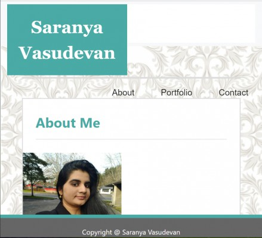
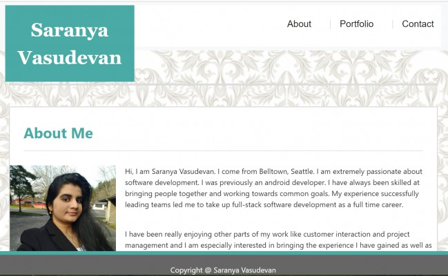

# portfolio_bootstrap
Name:
Bootstrap components added to Portfolio project

Descripton:
This project is about modifying the previous portfolio project to include bootstrap css framework. This is to ensure that we have a responsive layout. We also include navbars and other bootstrap components and enable the webpage to resize according to the screen size.

We use Bootstrap's grid system (containers, rows, and columns). On an xs screen, the content should take up the entire screen. On sm and larger screens, we should have some margins on the left and right sides of the screen. 

Visuals:

Here are some screenshots:

640px

768px

980px

Installation:

This webpage is available as my github page whose link is https://saranyav91.github.io/portfolio_bootstrap/

Usage:

This is, as mentioned earlier, a responsive webdesign. So, this webpage can be accessed from different devices of varied resolutions, whithout any issue in the page outlook and navigation.

Support:

Contact me, Saranya Vasudevan at sara.29891@gmail.com